# Feature Visualization in 3D Convolutional Neural Networks

[](https://arxiv.org/abs/2505.07387)  
Chunpeng Li, Ya-tang Li  

Official implementation of the paper **"Feature Visualization in 3D Convolutional Neural Networks"**, which can disentangle texture and motion preferences of a target 3D conv kernel with a data-driven decomposition method. It enables interpretable kernel visualizations for 3D models such as I3D, C3D, and 3D VQ-VAE.


---

## 🛠 Installation
Clone the repository and install the minimal dependencies:
```bash
git clone https://github.com/YatangLiLab/3DKernelVisualizer.git
cd 3DKernelVisualizer
pip install -r requirements.txt
```
#### 🔌 Optional: Install Extra Dependencies for Specific Models
To support different models, please install their dependencies manually.  
- For **C3D**:  
    There is no extra library needed.  
    Download the [pretrained weights](http://imagelab.ing.unimore.it/files/c3d_pytorch/c3d.pickle) and place it under the `modelzoo/pretrained/` directory.
- For **I3D**  
    Follow [INSTALL.md](https://github.com/facebookresearch/SlowFast/blob/main/INSTALL.md) of SlowFast  
    Download the [pretrained weights](https://dl.fbaipublicfiles.com/pyslowfast/model_zoo/kinetics400/I3D_8x8_R50.pkl)  
    Change the config `modelzoo/SlowFast/configs/Kinetics/c2/I3D_8x8_R50.yaml`  
    ```yaml
      TRAIN:
        CHECKPOINT_FILE_PATH: # path for download pretrained weights
      NUM_GPUS: 1
    ```
- For **3D VQ-VAE**  
    Follow [VideoGPT](https://github.com/wilson1yan/VideoGPT) for extra dependencies.  
    Download the [pretrained weights](https://drive.google.com/uc?id=1uuB_8WzHP_bbBmfuaIV7PK_Itl3DyHY5) and place it under the `modelzoo/pretrained/` directory.


## 🚀 Usage
To visualize:

```bash
python run.py --model i3d --output_path ./output
```

See modelzoo/config.yaml for model-specific options.

####  📁 Output Files
For each convolutional kernel, the visualization process produces 3 output files, named as `{model_name}_{layer_name}_{filter_index}_{type}.gif`  

| Suffix        | Description                                                                      |
|---------------|----------------------------------------------------------------------------------|
| `_stage1.gif` | **Stage 1 result**: the initial optimal input of target kernel                   |
| `_deform.gif` | **Decomposition**: the second-stage result showing static and dynamic components |
| `_recon.gif`  | **Reconstruction**: the reconstructed result from decomposed components          |

All outputs are saved under the `--output_path` directory.

> 💡 Tip: for best visualization, please assign `sigma`, `scale`, `max_value` in `run.py` for each kernel of deformation.


## 📈 Results  
Loading may take some time...


- #### Visualization of I3D 

| layer   | example 1                                                                                                                                                             | example 2                                                                                                                                                             | example 3                                                                                                                                                             |
|---------|-----------------------------------------------------------------------------------------------------------------------------------------------------------------------|-----------------------------------------------------------------------------------------------------------------------------------------------------------------------|-----------------------------------------------------------------------------------------------------------------------------------------------------------------------|
| stage 1 | 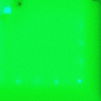<br/>          |  <br/>          |  <br/>          |
| stage 2 | 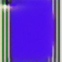<br/> | 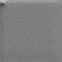<br/>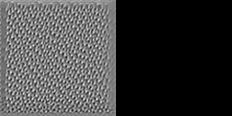 | 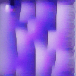<br/> |
| stage 3 | <br/>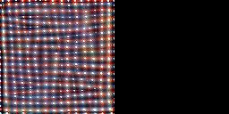 | 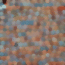<br/> | 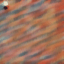<br/>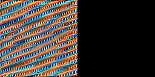 |
| stage 4 | <br/>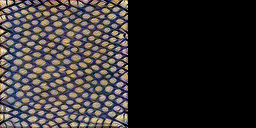 | <br/>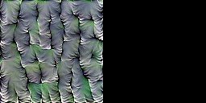 | <br/>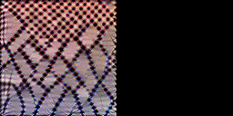 |
| stage 5 | 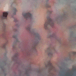<br/>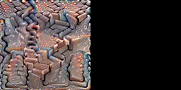 | <br/> | <br/>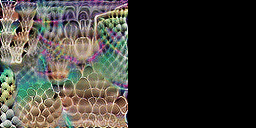 |


- #### Visualization of C3D 

| layer   | example 1                                                                                                                     | example 2                                                                                                                     | example 3                                                                                                                     |
|---------|-------------------------------------------------------------------------------------------------------------------------------|-------------------------------------------------------------------------------------------------------------------------------|-------------------------------------------------------------------------------------------------------------------------------|
| conv 1  | 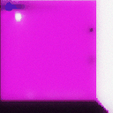<br/>  | 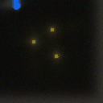 <br/>  |  <br/>  |
| conv 2  | <br/>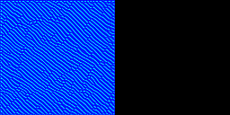   | <br/>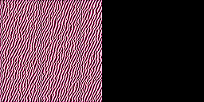   | 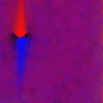<br/>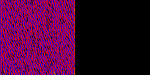   |
| conv 3b | <br/>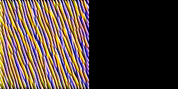 | 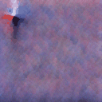<br/>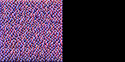 | <br/>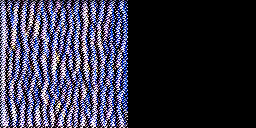 |
| conv 4b | 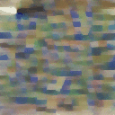<br/>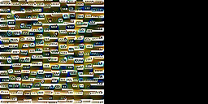 | <br/> | <br/>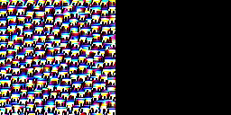 |
| conv 5b | 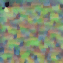<br/>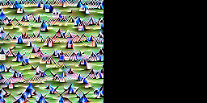 | 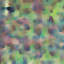<br/>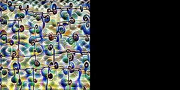 | 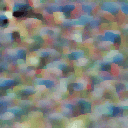<br/>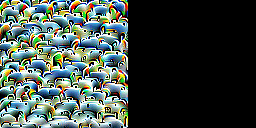 |


- #### Visualization of VQ-VAE 

| layer    | example 1                                                                                                                                                                             | example 2                                                                                                                                                                             | example 3                                                                                                                                                                             |
|----------|---------------------------------------------------------------------------------------------------------------------------------------------------------------------------------------|---------------------------------------------------------------------------------------------------------------------------------------------------------------------------------------|---------------------------------------------------------------------------------------------------------------------------------------------------------------------------------------|
| enc_c0   | <br/>                          |  <br/>                          | 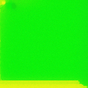 <br/>                          |
| enc_s3b5 | 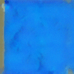<br/>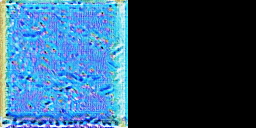 | 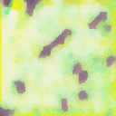<br/>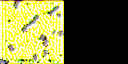 | 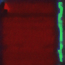<br/>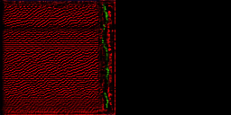 |


## 📑 Citation

If you find this code helpful, please cite our paper:
```BibTeX
@inproceedings{li20253dkernelvis,
      title={Feature Visualization in 3D Convolutional Neural Networks}, 
      author={Chunpeng Li and Ya-tang Li},
      booktitle={Lecture Notes in Computer Science},
      volume={15862},
      pages={402--412},
      year={2025},
      publisher={Springer},
}
```

## 🙏 Acknowledgements

This codebase draws inspiration and reuses components from [Lucent](https://github.com/greentfrapp/lucent).  
We also acknowledge the use of pretrained weights from 
[SlowFast](https://github.com/facebookresearch/SlowFast), 
[VideoGPT](https://github.com/wilson1yan/VideoGPT), 
[C3D (PyTorch)](https://github.com/DavideA/c3d-pytorch), 
[FlowNetPytorch](https://github.com/ClementPinard/FlowNetPytorch)

## 📜 License
This project is under the Apache 2.0 License. See [LICENSE](LICENSE) for details.
