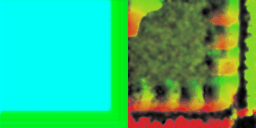
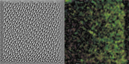
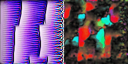
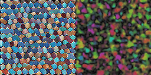
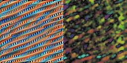
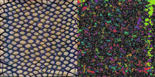
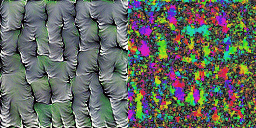
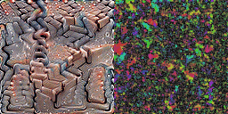
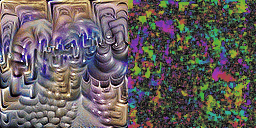

# Unlocking the Puzzle: A Visualization Tool for Explaining 3D Convolutions

## Results  
Loading may take some time...

#### Visualization of I3D 

| layer   | example 1                                          | example 2                                          |
|---------|----------------------------------------------------|----------------------------------------------------| 
| stage 1 |  |  |
| stage 2 |  |  |
| stage 3 |  |  |
| stage 4 |  |  |
| stage 5 |  |  |

